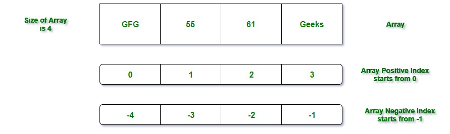

# array

- what is array ?
    - An array is a collection of different or similar items, stored at contiguous memory locations.
    - The idea is to store multiple items of the same type together which can be referred to by a common name.
    - ordered collections of objects.
    -  They can hold objects like integer, number, hash, string, symbol or any other array.



- Creation of 1-D array in Ruby

There are several ways to create an array. But there are two ways which mostly used are as follows:
1. Using the new class method
```ruby
name_of_array= Array.new
```
2. Using literal constructor[] In Ruby,
   [] is known as the literal constructor which can be used to create the arrays. Between [], different or similar type values can be assigned to an array
```ruby
arr = Array['a', 'b', 'c', 'd','e', 'f']
# or 
arr1 = ['a', 'b', 'c', 'd','e', 'f']
```

#### notes related to creation array
```ruby
arr = Array.new(4) # => [nil, nil, nil, nil]  create array with 4 elments every element is nil

names = Array.new(4, "mac") # => ["mac", "mac", "mac", "mac"]
 
```

#### Example

- Array#length
    - Basically length method used on arrays in ruby returns number of elements in the array for which method is invoked.
    ```ruby
    a = [1,2,3,4,5,6,7]
    a.length # 7
    ```
- Array#size
    - Array#size is just an alias to the Array#length method. It executes same Array#length method internally.
    ```ruby
        b = [1,2,3,4]
        b.size # 4
    ```
- Array#count
    - Count has some more functionalities than length/size. It can be used for getting number of elements based on some condition. Count can be called in three ways:


```ruby
c = [1,2,3,4,4,7,7,7,9]
# way 1
c.count #=> 9
# way 2
c.count(7) # => 3
# way 3
c.count { |i| i>5 } # => 4 As there are 4 elements in the array having value greater than 5.
```
Summary

The concept of ruby count vs length vs size was clarified in this tutorial. Few notes on when each of these methods should be used while coding:

1. Array#count should be used only for getting number of elements in array based on some condition.

2. Otherwise, for getting number of elements without any condition use Array#length or Array#size.

#### Retrieving Or Accessing Elements from Array

```ruby
# creating string using []
str = ["x", "y", "a", "b"]
 
# accessing array elements
# using index
puts str[1] # y
 
# using the negative index
puts str[-1] # b
```

#### Retrieving Multiple Elements from Array:
There can be many situations where the user need to access the multiple elements from the array. So to access the multiple elements, pass the two specified array index into the [].

```ruby
str = ["x", "y", "a", "b"]
# accessing multiple array elements
puts str[2,3] # => a b
```
- Note: If the user will try to access the element that doesn’t exist in the array then nil will return.
```ruby
str = ["x", "y", "a", "b"]
# accessing multiple array elements
puts str[6] # => nil
```


```ruby
arr = [1, 2, 3, 4, 5, 6]
arr[2]    #=> 3
arr[100]  #=> nil
arr[-3]   #=> 4
arr[2, 3] #=> [3, 4, 5]
arr[1..4] #=> [2, 3, 4, 5] # from 1 to 4 index
arr[1..-3] #=> [2, 3, 4]
```
- `at` Another way to access a particular array element is by using the at method

```ruby
arr = [1, 2, 3, 4, 5, 6]
arr.at(0) #=> 1
```

- fetch To raise an error for indices outside of the array bounds or else to provide a default value when that happens
```ruby
arr = ['a', 'b', 'c', 'd', 'e', 'f']
arr.fetch(100) #=> IndexError: index 100 outside of array bounds: -6...6
arr.fetch(100, "oops") #=> "oops" => default value if index outside of array
``` 

- The special methods first and last will return the first and last elements of an array, respectively.
```ruby
arr = [1, 2, 3, 4, 5, 6]
arr.first #=> 1
arr.last  #=> 6
```

- To return the first n elements of an array, use take
```ruby
arr = [1, 2, 3, 4, 5, 6]
arr.take(3) #=> [1, 2, 3]
```

- drop does the opposite of take, by returning the elements after n elements have been dropped:
```ruby
arr.drop(3) #=> [4, 5, 6]
```

### special methods
```ruby
browsers = ['Chrome', 'Firefox', 'Safari', 'Opera', 'IE']

browsers.empty? #=> false  => To check whether an array contains any elements at all
browsers.include?('Konqueror') #=> false => To check whether a particular item is included in the array
```

## Adding Items to Arrays
```ruby
arr = [1, 2, 3, 4]
# Items can be added to the end of an array by using either `push or <<`
arr.push(5) #=> [1, 2, 3, 4, 5]
arr << 6    #=> [1, 2, 3, 4, 5, 6]
# unshift will add a new item to the beginning of an array.
arr.unshift(0) #=> [0, 1, 2, 3, 4, 5, 6]
# With insert you can add a new element to an array at any position.
arr.insert(3, 'apple')  #=> [0, 1, 2, 'apple', 3, 4, 5, 6]
# Using the insert method, you can also insert multiple values at once:
arr.insert(3, 'orange', 'pear', 'grapefruit')
#=> [0, 1, 2, "orange", "pear", "grapefruit", "apple", 3, 4, 5, 6]
```

## Removing Items from an Array
```ruby
# The method pop removes the last element in an array and returns it:
arr =  [1, 2, 3, 4, 5, 6]
arr.pop #=> 6
arr #=> [1, 2, 3, 4, 5]

# To retrieve and at the same time remove the first item, use shift:
arr.shift #=> 1
arr #=> [2, 3, 4, 5]

# To delete an element at a particular index:
arr.delete_at(2) #=> 4
arr #=> [2, 3, 5]

# To delete a particular element anywhere in an array, use delete:
arr = [1, 2, 2, 3]
arr.delete(2) #=> 2
arr #=> [1,3]
```

## Get Max and Min numbers
```ruby 
arr = [1 , 2, 30, 20 , 0 , 1]
arr.max #=> 0
arr.min #=> 30
```


# more info about array after loops we will crash array